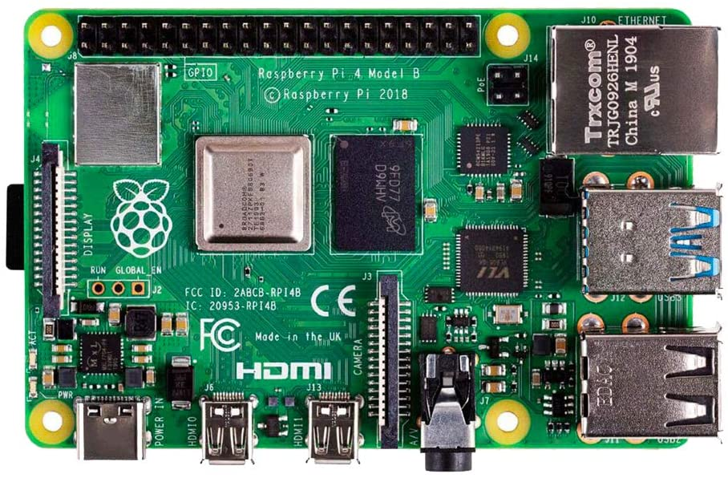
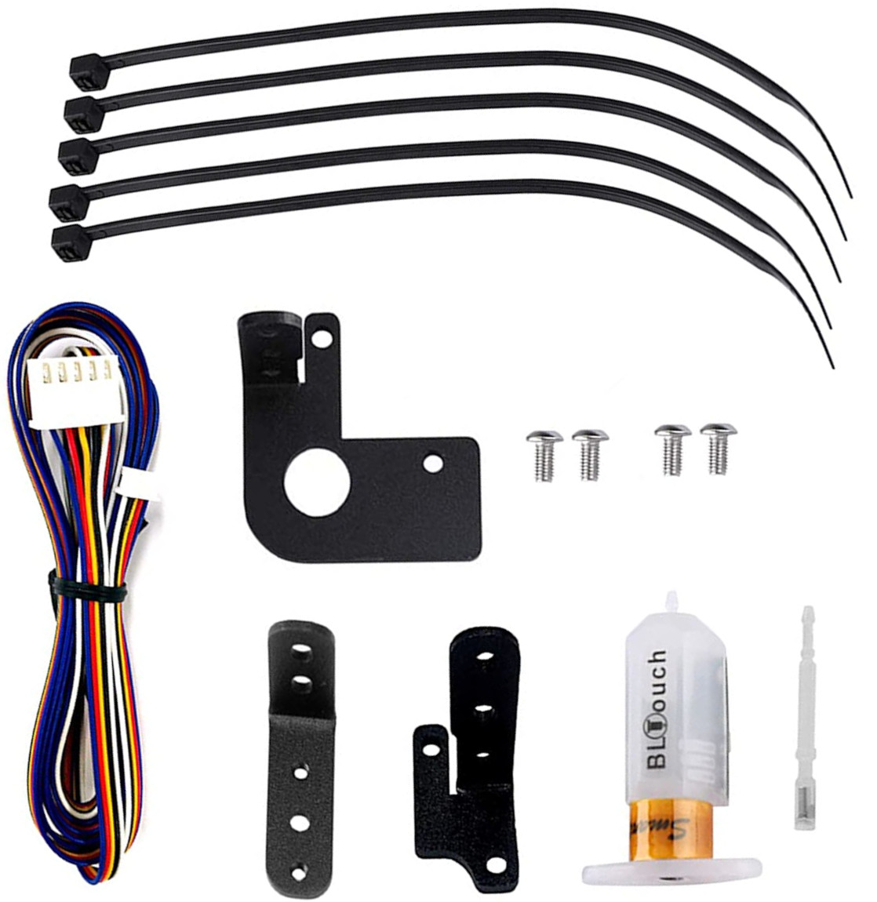
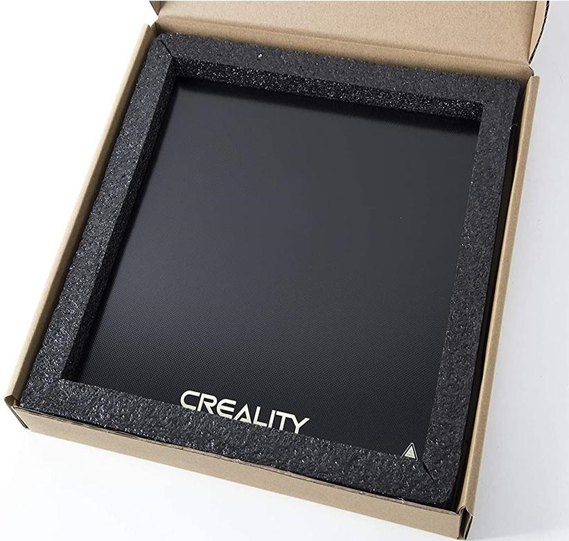
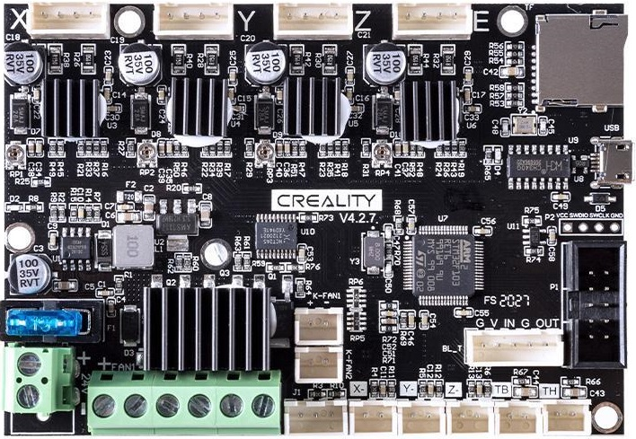
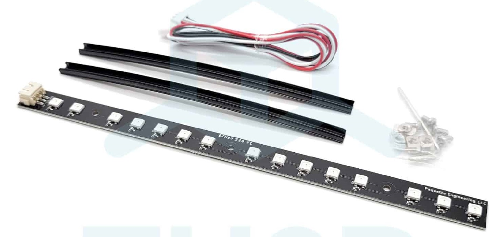
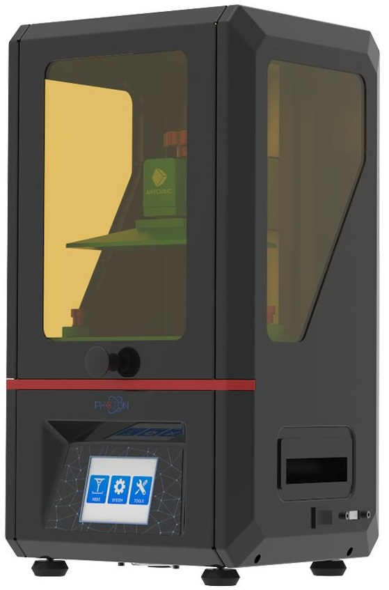

## {{ page.title }}
### So... You are interested in 3d Printing?
**Last Updated: {{ page.updated }}**

**Printing**... if you have ever setup a printer or worked in an office and had to print stuff, you know how frustrating printing can be. From the drivers, to the network, to the paper tray, it's all annoying and can ruin your print experience at any time. 2D Printing on paper has been a challenge for office workers since printers came on the market. In fact printers are so annoying they made a movie about it.

3d printing *can* be just as frustrating and annoying as any printer you have ever used. Imagine that 40 page assignment you had to have for your professor/boss that would not print properly. 3D printing is just like that, except, you cannot simply print page 38 over again and be ok. Since they build directly upon the layer below, if a layer(page) is not almost perfect the next layer will also not be perfect and it will build on that small error compounding over time into a failed print.

That said you can do a lot to make sure your print succeeds. From choosing the right printer, and the right filament. To leveling your print bed properly, and choosing the necessary slicer settings. You too can dial in your printer just right.

## What kind of printer should I get?
Before you choose a 3d printer you should think ahead about what you want to print. Minis, jewelry, and small parts are great for a DLP resin printer. Larger parts like: toys, structural elements, anything large , etc. are probs best printed on an FDM filament printer.

I am pretty happy with my Ender3Pro FDM printer. Recently I have upgraded it from the stock model to make it even better. FDM Printers like the Ender3pro are harder to upkeep as they have **many** moving parts and are quite technical to operate. I have been looking into resin printers for high detail small parts like Dnd Minis and jewelry. Resin printers are fast, easy to use and provide great detail to your prints. They are much simpler than FDM printers as they have far fewer moving parts.

The Ender 3 pro is no longer produced and has been replaced by the Ender 3 v2. Check out <a href="https://youtu.be/sbRHZUnmfYw">this great video</a> on its pro and cons.

Small resin printers in the sub $250 range are basically the same as larger more expensive versions. They are perfect for minis and high detail projects. This is a great video on resin printing: <a href="https://www.youtube.com/watch?v=WNgtWLBs4tc&ab_channel=ZackFreedman">by Zack Freedman</a>. I watched this and I was immediately inspired to plan my next printer purchase for resin minis.

So far, I have an the most experience with FDM printers and I am just getting started with resin.

Despite all the frustration and difficulty I have a lot of fun printing all sorts of stuff for fun and profits. I have compiled the information here in an effort to help others who are interested in the 3d printing world.

*Note: This page contains affiliate links.*

## Videos/People to watch
- This is a pretty cool video on getting started with 3d printing:
  - [https://youtu.be/T-Z3GmM20JM?t=26](https://youtu.be/T-Z3GmM20JM?t=26)
- As I said before, Zack Freedman has a great channel on all things maker and printer related:
  - [Zach Freedman](https://www.youtube.com/channel/UCUW49KGPezggFi0PGyDvcvg)
- This young lady, AuroraTech, is super informative as well:
  - [AuroraTech](https://www.youtube.com/channel/UCGER4yfUXubhNVPYoNzBSEA)

## My FDM Printer Setup
tldr; I have an ender 3 pro that I have upgraded quite a bit.

### Stock Ender 3 Pro

$209 The [Ender 3 Pro](https://www.creality3dofficial.com/products/creality-ender-3-pro-3d-printer) came as a kit to assemble. This made me more familiar with it and since I built it I feel like I can always fix it. :)

### Upgraded Ender 3 Pro
In general upgrades are not required. I used the stock ender 3 pro for more than a year before any upgrades at all. In that time I noticed issues the printer was having that I wanted to correct if possible. After the upgrades, my printer performs better and is more reliable. That said it's super fun to tinker with and improve your printer. Here are the upgrades I have done, in roughly the order I did them.

#### Raspberry Pi With the Octoprint Print Controller
If our printer supports it, you should set up an Octoprint print server. It provides a web interface to send jobs to your printer and basically control all of it's functions remotely.

$75-$160 [Raspberry Pi Kit w/ all the Trimmings](https://www.amazon.com/gp/product/B08B6F1FV5/ref=as_li_tl?ie=UTF8&camp=1789&creative=9325&creativeASIN=B08B6F1FV5&linkCode=as2&tag=hepaestus-20&linkId=1afde8e5c3316806a2f0a7fc6d2f4477)
- Software: https://octoprint.org/

#### Bed Leveling Sensor

$50 [BLTouch Sensor Kit](https://www.amazon.com/gp/product/B08MD3ZJTD/ref=as_li_tl?ie=UTF8&camp=1789&creative=9325&creativeASIN=B08MD3ZJTD&linkCode=as2&tag=hepaestus-20&linkId=864136347d011df6561688104b04d88a), [Creality Webpage](https://www.creality3dofficial.com/products/creality-bl-touch)
- This sensor precisely measure the distance to your print bed and uses some fancy maths to calculate the flatness of your print bed.
  - Works with Octoprint to make cool graphs of your beds flatness.

#### Tempered Glass Build Plate

$20 [Tempered Glass Build Plate](https://www.amazon.com/gp/product/B0836PMMZ5/ref=as_li_tl?ie=UTF8&camp=1789&creative=9325&creativeASIN=B0836PMMZ5&linkCode=as2&tag=hepaestus-20&linkId=4ee35e7121f259785375567901e87fbe), [Official Page](https://www.creality3dofficial.com/products/creality-new-upgraded-heated-bed-build-plate-surface)

#### Creality 4.2.7 Silent Control Board
This was the single best upgrade I have made.

$50 [SIlent Board 4.2.7 Upgrade](https://www.amazon.com/gp/product/B08G4SCZDR/ref=as_li_tl?ie=UTF8&camp=1789&creative=9325&creativeASIN=B08G4SCZDR&linkCode=as2&tag=hepaestus-20&linkId=499a6468147e8fd54ca7d8515820e4d1) , [Official Webpage](https://creality3d.shop/products/creality3d-upgrade-silent-4-2-7-1-1-5-mainboard-for-ender-3-ender-3-pro-ender-5-3d-printer)
- The upgraded board makes the printer much quieter and faster, pretty much silently running the stepper motors. New Ender 3 models come with an upgraded control board. I am not sure of the model. Now I think they come stock with the better 4.2.2 or 4.2.7.

#### Dual Z-Axis
This upgrade was mostly for piece of mind. The single z-axis that comes on stock on my printer seems to sag on the right hand side. This "sag" may have all been in my head. Regardless, I think it was a good upgrade.

$40 [Dual Z-Axis](https://www.amazon.com/gp/product/B08S71B4R9/ref=as_li_tl?ie=UTF8&camp=1789&creative=9325&creativeASIN=B08S71B4R9&linkCode=as2&tag=hepaestus-20&linkId=320864efd892784efadbcc762672d5ca)

The Stock Ender 3 Printers only have a single Z-Axis. The dual Z axis ensures but sides are always perfectly inline with each other.

#### OMG EXTRUDE Direct Drive Extruder

$85 [OMG Extruder](https://www.amazon.com/gp/product/B098TZ2PYK/ref=as_li_tl?ie=UTF8&camp=1789&creative=9325&creativeASIN=B098TZ2PYK&linkCode=as2&tag=hepaestus-20&linkId=a5331e21dafcba92c619657d935876a1)

#### Creality Upgraded Hot End

$30 [Upgraded Hot End](https://www.amazon.com/gp/product/B09D871W68/ref=as_li_qf_asin_il_tl?ie=UTF8&tag=hepaestus-20&creative=9325&linkCode=as2&creativeASIN=B09D871W68&linkId=44f0310a6821435588c54bfa1f439df4)

#### RBG Lights

- $24 [Official Site](https://www.th3dstudio.com/product/ezneo220-rgb-printer-lighting-strip/)
  - This is more important then you might think if you plan to create timelapse videos of your prints. Also it flashes colors to indicate printing issues.

#### Filament Sensor

- $10 [Creality Filament Sensor](https://www.amazon.com/gp/product/B087325BPG/ref=as_li_qf_asin_il_tl?ie=UTF8&tag=hepaestus-20&creative=9325&linkCode=as2&creativeASIN=B087325BPG&linkId=4148d73475d6ac6adc908aa50715b273)

### Upgrade Results On The Hot End

Here is my current hot end configuration. BLTouch, Hot end upgrade. Still working on the cooling fan upgrade.

### Firmware Upgrades
I used the [Unified Firmware Help](https://www.th3dstudio.com/hc/category/downloads/unified-2-firmware/). Download it here: [TH3D Studio Firmware Package](https://www.th3dstudio.com/hc/downloads/unified-1-firmware/th3d-unified-1-firmware-package/). You will need [VSCode](https://code.visualstudio.com/) with [Platform IO](https://platformio.org/install/ide?install=vscode). This is probably the most difficult upgrade as it involves compiling code and setting up code parameters. You need to modify the firmware files and select the options you intend to use with your printer. VSCode and PlatformIO make this easier but not foolproof. I did over 30 compiles and uploads before I got it all working properly.

### Further Planned FDM Printer Upgrades
- 3d Printed Fan Shroud
  - [Hero ME Gen 5 Master Suite Fan Duct](https://www.thingiverse.com/thing:4460970)
    - [Direct Download](https://www.thingiverse.com/download:11204350)

## My SLA(resin) Printer Setup
<picture>

</picture>
<picture>

</picture>

I have an [Anycubic Photo S](https://www.anycubic.com/collections/anycubic-photon-3d-printers/products/anycubic-photon-3d-printer)resin printer for Dnd minis and small precision parts. I also opted for the [Wash and Cure Station 2.0](https://www.amazon.com/gp/product/B08JCSSTD5/ref=as_li_qf_asin_il_tl?ie=UTF8&tag=hepaestus-20&creative=9325&linkCode=as2&creativeASIN=B08JCSSTD5&linkId=57b74f3e05d795dc64de733455e5f6f0). This was a bonus as it makes clean up much easier and faster.

## Other Printers Of Note
If you have a larger budget and larger ambitions, and or want to print super long/tall items, or a huge series or multiples this is what you would want :)  $+1K [Creality CR30](https://www.creality3dofficial.com/products/cr-30-infinite-z-belt-3d-printer) Infinite Z Belt Printer.

## Stuff to print
For starters try printing a [Benchy](https://www.3dbenchy.com/)

- Benchy is quick to print and can help fine tune your prints. A good benchy is an indicator of a well set up printer.

### Tools for Creating Minis
Hero Forge has a great tool for designing *custom* gaming minis that you can download at STL files for your slicer. Custom STL files are about $3.50 USD.
- [https://heroforge.com/](https://heroforge.com/)

Eldritch Foundry also lets you create custom STL character files where you pay to download a printable file.
- [https://eldritch-foundry.com/](https://eldritch-foundry.com/)

My Mini Factory has free and paid minis to print.
- [https://www.myminifactory.com/](https://www.myminifactory.com/)

### Sites with paid and free models to print
Here are a few places to get awesome things to print
- [https://thangs.com/](https://thangs.com/)
- [https://www.thingiverse.com/](https://www.thingiverse.com/)
- [https://3dcults.com](https://3dcults.com)

## What do I need?
### Emotional needs

1. **Patience** You will need patience as 3d printing is a slow process, more like sending a book to the printer than sending a single page. Expect to wait so see the fruits of your labor.
2. **Resiliency** You are going to have failed prints. You just are. There will be dust or oil on your build plate. Your prints won't stick to the build plate. On the tail end of a print you will lose power. It will happen. You will fail and you will need to be able to clean that build plate, reload more filament/resin, and try again, and probs a third time. Before you get that perfect print.
3. **Anger Management Skills** Remember how I said you were going to fail, well it's gonna drive you crazy mad insane at times, so you need to be able to manage that. Like have a second less frustrating hobby to do while you wait for your print to turn into a spaghetti nest.

### Hardware you will need
In addition to your 3d printer you will need a computer. Almost any recent laptop or desktop, pc, linux, or mac, can run the required software. You may need access to a USB port to save your files to a thumb drive or an SD card port. Chromebooks or tablets are not a substitute.

### Software You Will Need
You can download ready to print files from the internet quite easily, but if you have your own idea for a print you will need to render it in a drawing program. You will likely want to use a <a href="https://en.wikipedia.org/wiki/Parametric_design">parametric drafting program</a> to best create your models. There are also software sculpting tools that will create STL files but I have not tried them.

Here are options to try. These two are well supported with tons of video tutorials on youtube.
- Drawing/Modeling/Drafting Software
  - Fusion 360 (might be free for personal use) I have the most experience with this.
    - Parametric Drafting software for creating and editing stl files to print.
      - [https://www.autodesk.com/products/fusion-360/personal](https://www.autodesk.com/products/fusion-360/personal)
  - FreeCad (free software) I have never successfully used this to create a model. I have not given it the attention I have given Fusion 360.
    - Open Source (Free) Parametric Drafting software.
      - [https://www.freecadweb.org/](https://www.freecadweb.org/)

Once you have a model to print, you will need "Slicer" software to convert your model to GCode your printer can understand. Slicers generally take STL files as input. Most slicers are pretty easy to use. Create a new project and import/open your stl files. Arrange them on the print plate and slice.
- Slicers (I have tried)
  - Super Slicer (based on Slic3r)
    - This is an awesome slicer that is easy to use and
    - [https://github.com/supermerill/SuperSlicer/releases#assets](https://github.com/supermerill/SuperSlicer/releases)
      - Goto Assets and choose your OS.
  - Cura
    - [https://ultimaker.com/software/ultimaker-cura](https://ultimaker.com/software/ultimaker-cura)
  - Prusa Slicer (also based on Slic3r)
    - [https://www.prusa3d.com/page/prusaslicer_424/](https://www.prusa3d.com/page/prusaslicer_424/)

Finally when you are printing you will want the best interface possible. For my Ender 3 Pro I use Octoprint. Octoprint connects to your printer and controls it remotely. You can use the web interface to upload files to print and track print progress and status. You can use additional plugins to create time lapse videos of your prints or send you an SMS when printing is done. Watch or check on your print remotely via webcam.

- Octoprint: https://octoprint.org/
  - [Latest Version](https://octoprint.org/download/)
    - SDCard Creation (for setting up octoprint)
      - [RaspberryPi Image Burner](https://www.raspberrypi.com/news/raspberry-pi-imager-imaging-utility/)

## How do I do any of this? What do I do first?
1. Buy an [FDM 3d printer](https://www.amazon.com/gp/product/B07BR3F9N6?ie=UTF8&tag=hepaestus-20&camp=1789&linkCode=xm2&creativeASIN=B07BR3F9N6) or buy a [Resin 3d printer](https://www.amazon.com/gp/product/B093SC6TDS/ref=as_li_tl?ie=UTF8&camp=1789&creative=9325&creativeASIN=B093SC6TDS&linkCode=as2&tag=hepaestus-20&linkId=810d8c7f677357e3159bfeb3a8e36727)
2. Assemble the printer according to the instructions.
3. If your printer supports using one, [buy a Raspberry Pi, SD Card, Power supply](https://www.amazon.com/gp/product/B07V5JTMV9/ref=as_li_tl?ie=UTF8&camp=1789&creative=9325&creativeASIN=B07V5JTMV9&linkCode=as2&tag=hepaestus-20&linkId=c66b26ab4414e7a0eabea9f756b3ac70) (The Photon S does not support Octoprint)
4. [Download and Setup Octoprint](https://octoprint.org/download/).
5. Install Software
   - Drawing Software
     - [Fusion 360](https://www.autodesk.com/products/fusion-360/personal)
     - [FreeCad](https://www.freecadweb.org/)
     - Others ???
   - Slicing Software
     - FDM Slicers
       - [Cura](https://ultimaker.com/software/ultimaker-cura)
       - [Super Slicer](https://github.com/supermerill/SuperSlicer/releases)
       - [Prusa Slicer](https://www.prusa3d.com/page/prusaslicer_424/)
     - Resin printer Slicer
       - [Photon Workshop](https://github.com/ANYCUBIC-3D/PhotonWorkshop/releases) (Slicer for Anycubic Resin Based Printers.)
         - Came with the printer on the USB stick, but you should get the latest version.
6. Create/Download your model files
7. Slice the model file to GCode
8. Upload to your printer and print.

### Printing Workflow
Your workflow will be as such:
1. Create/Download an model in STL format.
2. Import/Open your stl file in your slicer of choice.
3. Update your slicer and print settings for this specific file.
4. Generate your GCode with the Slicer software.
5. Upload GCode to your Printer via sneaker-net or Octoprint depending on printer.
6. Print your file!
7. Clean your print
8. Cure your print
9. Remove supports and assemble
10. Enjoy your sweet print!

## Some of my successful prints
- [Dactyl Manuform Keyboards](https://www.thingiverse.com/thing:3037954)
- [The Segmented Slug/Worm](https://www.thingiverse.com/thing:4727448)
- [Temps-O-Matic Enclosures](https://temps-o-matic.com)
- [Articulated Dragon](https://cults3d.com/en/3d-model/game/articulated-dragon-mcgybeer)

## 3D Printing Consumables

<picture>
  
</picture>

<picture>
  
</picture>

### You will also need supplies

- FDM Printers
  - Filaments (I have tried these)
    - COEX PLA and PLA Prime
    - Matter Hackers Build Filament
    - Solutech ABS
      - [Acetone](https://www.amazon.com/gp/product/B07FTP6BDW/ref=as_li_tl?ie=UTF8&camp=1789&creative=9325&creativeASIN=B07FTP6BDW&linkCode=as2&tag=hepaestus-20&linkId=d3db9644e5173279bdc866ec100bb5cc) if you print ABS
- DLP Printers
  - Resin (I have tried this)
    - [Anycubic Basic Grey 405nm](https://www.anycubic.com/collections/uv-resin)
  - [FEP Film for DLP Printing](https://www.amazon.com/gp/product/B08JTL4CCQ/ref=as_li_tl?ie=UTF8&camp=1789&creative=9325&creativeASIN=B08JTL4CCQ&linkCode=as2&tag=hepaestus-20&linkId=8a056fed7d66201a1a780e9575862faf) [Official Site](https://www.anycubic.com/collections/for-photon-series/products/fep-film-for-dlp-photon-printer)
    - The film on your print tray needs to be replaced if it gets damaged.
  - [Gloves](https://www.amazon.com/gp/product/B09JGP2L51/ref=as_li_tl?ie=UTF8&camp=1789&creative=9325&creativeASIN=B09JGP2L51&linkCode=as2&tag=hepaestus-20&linkId=dccad6d3e796f94cc2d2be8165154832)
  - [Filters](https://www.amazon.com/gp/product/B07V4WRJJG/ref=as_li_tl?ie=UTF8&camp=1789&creative=9325&creativeASIN=B07V4WRJJG&linkCode=as2&tag=hepaestus-20&linkId=1d9ea591f651937d8b3d8c77b0fed5e5)
  - Solvents for cleaning
    - [Acetone](https://www.amazon.com/gp/product/B07FTP6BDW/ref=as_li_tl?ie=UTF8&camp=1789&creative=9325&creativeASIN=B07FTP6BDW&linkCode=as2&tag=hepaestus-20&linkId=d3db9644e5173279bdc866ec100bb5cc)
    - [Isopropyl Alcohol](https://www.amazon.com/gp/product/B07J49CD76/ref=as_li_tl?ie=UTF8&camp=1789&creative=9325&creativeASIN=B07J49CD76&linkCode=as2&tag=hepaestus-20&linkId=d2661c97d1233215225a4b9bf4fd4eb8)

## Future Topics of interest
What would you like to see more info about?

## Do You Have A Question? A Comment? Did you find an error?
If you want to ask a question, comment, or report an error please click [here and do your thing](https://github.com/hepaestus/3d-printing/issues/new). Or send an email to [hepaestus@gmail.com](mailto://hepaestus@gmail.com).
